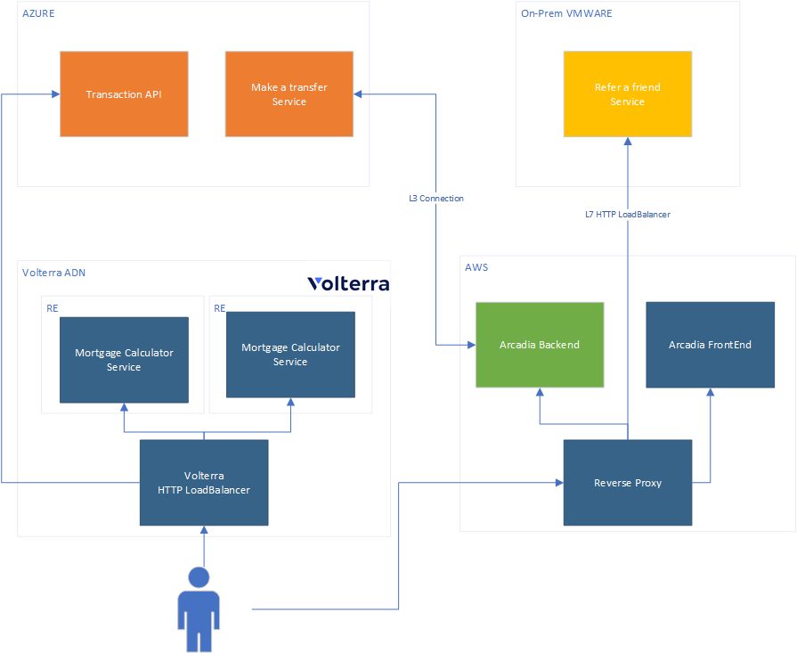

Prerequisites
-------------

1. Volterra Account with delegated domain name
2. AWS VM and connected as a Site
3. Azure VM and connected as a Site
4. VMWare VM and connected as a Site

Architecture reference:

Azure VM configuration
----------------------

Contains components:

* money transfer module, port: 80
* transaction-api, port 8082
* connectivity test tool (optional): port 8081

Use docker-compose file from ./azure/docker-compose.yaml

::

  sudo docker-compose up -f ./azure/docker-compose.yaml

AWS VM configuration
--------------------

Contains components:
* arcadia frontend
* arcadia backend
* reverse-proxy, port 80

Arcadia Frontend

Replace in JS file **"calculator.arcadia.volterra.demomix.online"** to domain you want to use.
dockerhub image has a hardcaded value.
/main/MainApp/trading/js/mortgage.js

It is possible to use a docker-compose.yaml in the root directory to build and run solution.

Fix money-transfer reference by adding extra_hosts parameter to nginx-reverse-proxy and change it in the /nginx-reverse-proxy/default.conf

::

  extra_hosts:
    - "money-transfer.internal:192.168.32.6"

Run docker compose

::

  sudo docker-compose up frontend
  sudo docker-compose up backend
  sudo docker-compose up nginx

VMWare
------

Contains components:

* refer-a-friend module, port: 80
* connectivity test tool, port: 8081

Use docker-compose file from ./vmware/docker-compose.yaml

::

  sudo docker-compose up -f ./vmware/docker-compose.yaml
  
  
Volterra VK8S
-------------

Contains components:

* mortgage-calculator module, port: 8080 => 443
* connectivity test tool(optional)

Create a workload with 2 containers inside. (nginx webserver and phpfpm sidecar)
::

  Container name: webserver
  Image Name: docker.io/interestingstorage/arcadia-mortgage-calculator:vk8s-isc-2021
  Registry: Public (It's better to attack your account to avoid download limit messages)
  Command: 
    /bin/sh
    -c
  Arguments:
    cp -r /usr/share/nginx/html/* /mnt/web/web-data/ && nginx -g 'daemon off;'

::

  Container name: phpfpm
  Image Name: docker.io/interestingstorage/arcadia-phpfpm:vk8s-isc-2021
  Registry: Public (It's better to attack your account to avoid download limit messages)

::

  Volumes:
  Name: web-data
  Volume: Empty Directory Volume
  Size Limit: 1
  Volume Mount: 
    Mode: Read Write
    Mount Path: /mnet/web/web-data/
    Advertise Options: Advertise on Internet
      Port: 8080 TCP
      HTTP/HTTPS Load Balancer:
        Domain: yourdomain.examle.com
        
        
Connection Configuration
------------------------

1. Connection AWS, Azure and VMWare as Sites
2. Configure GlobalNetwork (L3 Connection) Between Azure and AWS
3. Create HTTP LoadBalancer for Refer a Friend

::

  Domain: refer-a-friend.internal
  Origin Pool
    Type of Origin Server: IP Address of Origin Server on given Site
    IP: <<VMWARE VM IP>>
    Site: vmware-private-dc
    Network: Outside network
    Port: 80
  Advertise Custom
    Where: Site
    Network: Inside Network
    Sire reference: aws-europe-site
    
4. Create HTTP LoadBalancer for Transaction API

::

  Domain: transaction-api.arcadia.volterra.demomix.online (your domain name here)
  Load Balancer Type: HTTPS with Auto Certificate
  Redirect HTTP to HTTPS: true
  Origin Pool
    Type of Origin Server: IP Address of Origin Server on given Site
    IP: <<Azure VM IP>>
    Site: azure-vnet-site
    Network: Inside network
    Port: 8082
  Advertise On Internet
    
    
Transaction API Traffic Generator
---------------------------------

Use docker-compose file from ./test-vm/docker-compose.yaml

Update BASE_URL environemnt with your domain name

::

  sudo docker-compose up -f ./test-vm/docker-compose.yaml
  
